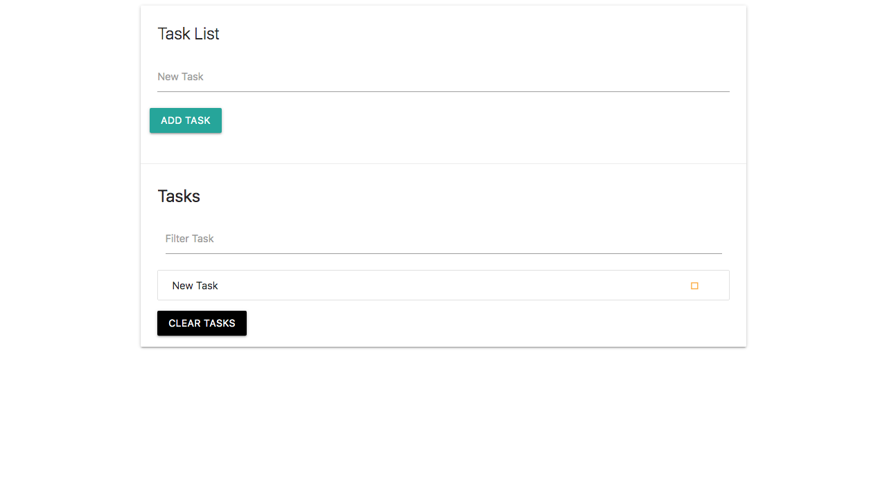

# Tasklist

In this project, you can list tasks you want to perform in order of their priorities. The tasks automatically clears after it has been marked as completed.
This project was built as a practice project to learn DOM Manipulation elements in JavaScript. This was built using HTML, JQuery, and HTML.
